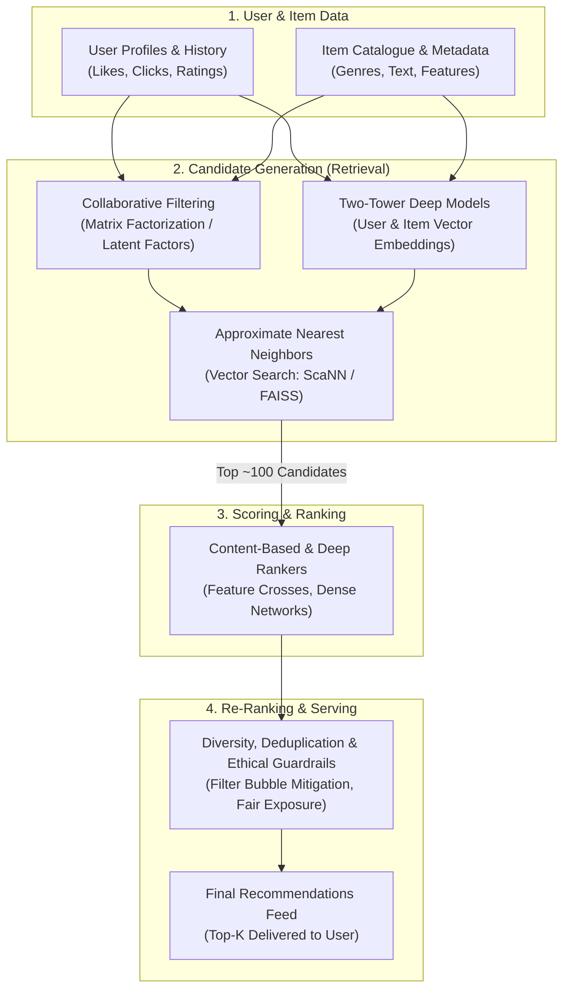

# 🎯 Recommender Systems: From Mathematical Foundations to Deep Learning

[](https://github.com/TechGenDM/Recommender-Systems/stargazers)
[](https://github.com/TechGenDM/Recommender-Systems/network/members)
[](LICENSE)
[](https://www.python.org/)
[](https://tensorflow.org/)
[](#curriculum-roadmap)

> **A comprehensive, rigorous, and code-first open-access masterclass on Recommender Systems.**  
> Designed for college students, software engineers, and machine learning practitioners seeking to master both the mathematical intuition and production-grade implementation of recommendation engines.

---

## 🌟 Philosophy & Pedagogical Approach

Modern recommendation engines power the world's most critical digital experiences—from Netflix and YouTube to Spotify, Amazon, and TikTok. However, learning materials often swing between high-level conceptual hand-waving and opaque, black-box library tutorials.

This curriculum follows a battle-tested 4-pillar pedagogical framework:

1. **Intuition First**: Demystify *why* an algorithm works through geometric analogies and real-world scenarios before looking at code.
2. **Mathematical Rigor**: Derive cost functions, gradients, vector projections, and latent representations step-by-step.
3. **From-Scratch & TensorFlow Implementation**: Build algorithms end-to-end using standard numerical libraries and deep learning frameworks (`tf.GradientTape`, custom layers, and vector search).
4. **Systems & Ethics**: Tackle scale (large catalogues, latency constraints, retrieval vs. ranking) and responsibility (algorithmic bias, filter bubbles, feedback loops).

---

## 🏗️ High-Level System Architecture



---

## 📚 Complete Curriculum Roadmap

The modules below are ordered sequentially. Each topic builds directly on the theoretical and practical foundations laid by the previous chapters.

| # | Topic | Key Concepts | Focus | Status |
|:---:|:---|:---|:---:|:---:|
| **01** | [Making Recommendations](<./1. Making recommendations.md>) | Problem formulation, explicit vs. implicit feedback, recommendation matrix | 🧠 Concept | ✅ Completed |
| **02** | [Using Per-Item Features](<./2. Using Per-Item Features.md>) | Content-based linear regression, parameter optimization per user | 📐 Math & Logic | ✅ Completed |
| **03** | [Collaborative Filtering Algorithm](<./3. Collaborative Filtering Algorithm.md>) | Joint optimization, latent factors $w^{(u)}$, $x^{(i)}$, simultaneous gradient descent | 📐 Math & Algo | ✅ Completed |
| **04** | [Binary Labels: Favs, Likes, and Clicks](<./4. Binary Labels: Favourites, Likes & Clicks.md>) | Implicit feedback, logistic loss, binary cross-entropy formulation | 📐 Formulation | ✅ Completed |
| **05** | [Mean Normalization](<./5. Mean Normalization.md>) | Cold-start mitigation, unrated items, baseline offset adjustment | 💡 Intuition | ✅ Completed |
| **06** | [TensorFlow Implementation of Collaborative Filtering](<./6. TensorFlow Implementation of Collaborative Filtering.md>) | Vectorization, `tf.Variable`, AutoDiff with `tf.GradientTape`, custom loss | 💻 Code / TF | ✅ Completed |
| **07** | [Finding Related Items](<./7. Finding Related Items.md>) | Latent space distance, Euclidean distance $\|x^{(i)} - x^{(k)}\|^2$, Cosine similarity | 📐 Math & Logic | ✅ Completed |
| **08** | [Collaborative Filtering vs. Content-Based Filtering](<./8. Collaborative Filtering vs. Content-Based Filtering.md>) | Comparative trade-off matrix, cold-start vulnerability, scaling properties | ⚖️ Analysis | ✅ Completed |
| **09** | [Deep Learning for Content-Based Filtering](<./9. Deep Learning for Content-Based Filtering.md>) | Two-tower neural architectures, user embeddings $v_u$, item embeddings $v_m$ | 🧠 Deep Learning | ✅ Completed |
| **10** | [Recommending from a Large Catalogue](<./10. Recommending from a Large Catalogue.md>) | Two-stage pipeline: Retrieval (Candidate Generation) + Ranking, Vector Indexing | 🚀 Scale & Sys | ✅ Completed |
| **11** | [Ethical Use of Recommender Systems](<./11. Ethical Use of Recommender Systems.md>) | Filter bubbles, engagement traps, algorithmic bias, fairness, transparency | 🛡️ Ethics | ✅ Completed |
| **12** | [TensorFlow Implementation of Content-Based Filtering](<./12. TensorFlow Implementation of Content-Based Filtering.md>) | Two-tower network in Keras/TF, dot-product output layer, evaluation | 💻 Code / TF | ✅ Completed |
| **13** | [Reducing the Number of Features (Optional)](<./13. Reducing the Number of Features.md>) | High-dimensionality curse, compression, variance preservation intuition | 🔍 Extension | ✅ Completed |
| **14** | [PCA Algorithm (Optional)](<./14. PCA Algorithm.md>) | Covariance matrix, projection, eigenvalue decomposition, singular value decomposition | 📐 Math / Algo | ✅ Completed |
| **15** | [PCA in Code (Optional)](<./15. PCA in Code.md>) | From-scratch NumPy implementation, Scikit-Learn comparison, visualization | 💻 Code | ✅ Completed |

---

## 📖 Module-by-Module Detailed Breakdown

### Phase 1: Problem Formulation & Feature-Driven Baselines

#### [01. Making Recommendations](<./1. Making recommendations.md>)
- **Intuition**: Why recommendations are distinct from standard supervised classification and regression.
- **Formulation**: The user-item interaction matrix $R$, where $r(i,j) = 1$ if user $j$ rated item $i$, and $y^{(i,j)}$ is the rating value.
- **Challenges**: Sparsity (typically $>99\%$ sparse), scale, and the cold-start dilemma.

#### [02. Using Per-Item Features](<./2. Using Per-Item Features.md>)
- **Concept**: Leveraging item metadata $x^{(i)}$ (e.g., romance vs. action score) to learn personalized user preference vectors $w^{(j)}$ and bias $b^{(j)}$.
- **Model**: Predicted rating $\hat{y}^{(i,j)} = w^{(j)} \cdot x^{(i)} + b^{(j)}$.
- **Cost Function**: Regularized Mean Squared Error (MSE) optimized across rated items for each user independently.

---

### Phase 2: Collaborative Filtering & Latent Factor Models

#### [03. Collaborative Filtering Algorithm](<./3. Collaborative Filtering Algorithm.md>)
- **The Core Breakthrough**: What if we don't have explicit item features? We can learn user preferences $w^{(j)}$ and item features $x^{(i)}$ *simultaneously*.
- **Unified Objective Function**:
  $$J(w, b, x) = \frac{1}{2} \sum_{(i,j): r(i,j)=1} \left( w^{(j)} \cdot x^{(i)} + b^{(j)} - y^{(i,j)} \right)^2 + \frac{\lambda}{2} \sum_{j=1}^{n_u} \sum_{k=1}^n (w_k^{(j)})^2 + \frac{\lambda}{2} \sum_{i=1}^{n_m} \sum_{k=1}^n (x_k^{(i)})^2$$
- **Optimization**: Gradient updates alternating or running jointly over parameter tensors.

#### [04. Binary Labels: Favs, Likes, and Clicks](<./4. Binary Labels: Favourites, Likes & Clicks.md>)
- **Implicit Feedback Reality**: Real-world platforms rarely collect 1-5 star ratings; interactions are binary (click, like, favorite, watch $>30\text{s}$).
- **Probabilistic Formulation**: Predicting $P(y^{(i,j)}=1) = g(w^{(j)} \cdot x^{(i)} + b^{(j)})$, where $g(z) = \frac{1}{1 + e^{-z}}$.
- **Loss Function**: Binary Cross-Entropy applied to interaction signals.

#### [05. Mean Normalization](<./5. Mean Normalization.md>)
- **The Cold-User Problem**: For a new user with zero ratings, standard regularization shrinks $w^{(j)} \to 0$, predicting zero for everything.
- **Normalization Strategy**: Subtract the mean rating $\mu_i$ for each item, train on normalized matrix, and predict $\hat{y}^{(i,j)} = w^{(j)} \cdot x^{(i)} + b^{(j)} + \mu_i$.
- **Outcome**: A new user with no history is defaulted to average item ratings instead of zeros.

#### [06. TensorFlow Implementation of Collaborative Filtering](<./6. TensorFlow Implementation of Collaborative Filtering.md>)
- **Hands-on Lab**: Building collaborative filtering from scratch in TensorFlow.
- **Core Techniques**:
  - Vectorized loss computation using boolean masking (`tf.gather_nd` / element-wise multiplication).
  - Custom training loops using `tf.GradientTape()`.
  - Gradient optimization with `tf.keras.optimizers.Adam`.

#### [07. Finding Related Items](<./7. Finding Related Items.md>)
- **Geometric Latent Space**: Once features $x^{(i)}$ are learned, items reside in an $n$-dimensional latent semantic space.
- **Similarity Metrics**:
  - Squared distance: $\|x^{(i)} - x^{(k)}\|^2 = \sum_{l=1}^n (x_l^{(i)} - x_l^{(k)})^2$
  - Cosine similarity: $\cos(\theta) = \frac{x^{(i)} \cdot x^{(k)}}{\|x^{(i)}\| \|x^{(k)}\|}$
- **Use Cases**: "Users who liked this also liked..." and automated playlist / related video carousels.

---

### Phase 3: Content-Based Filtering & Modern Deep Architectures

#### [08. Collaborative Filtering vs. Content-Based Filtering](<./8. Collaborative Filtering vs. Content-Based Filtering.md>)
- **Deep-Dive Comparative Analysis**:
  - **Collaborative Filtering**: Discovers serendipitous items; struggles with cold start; doesn't require domain features.
  - **Content-Based Filtering**: Excellent cold-start handling for new items; transparent and explainable; struggles to recommend outside user's current niche.
- **Decision Matrix**: When to choose which approach in production.

#### [09. Deep Learning for Content-Based Filtering](<./9. Deep Learning for Content-Based Filtering.md>)
- **Two-Tower Neural Network Architecture**:
  - **User Tower**: Deep Feedforward Network mapping user features (demographics, interaction history, device) $\to$ embedding vector $v_u \in \mathbb{R}^d$.
  - **Item Tower**: Deep Feedforward Network mapping item features (title embeddings, category, age, tags) $\to$ embedding vector $v_m \in \mathbb{R}^d$.
- **Prediction**: $\hat{y} = v_u \cdot v_m$.

#### [10. Recommending from a Large Catalogue](<./10. Recommending from a Large Catalogue.md>)
- **The Production Bottleneck**: Scoring millions of items with a neural network in real-time ($<50\text{ms}$) is computationally infeasible.
- **The Two-Stage Industry Standard Pipeline**:
  1. **Candidate Retrieval (Candidate Generation)**: Filter millions down to hundreds using fast Approximate Nearest Neighbors (ANN) vector search (e.g., Google ScaNN, FAISS, HNSW).
  2. **Scoring & Ranking**: Pass the candidate subset through a fine-grained, compute-heavy deep ranker.

#### [11. Ethical Use of Recommender Systems](<./11. Ethical Use of Recommender Systems.md>)
- **Systemic Implications**:
  - **Filter Bubbles & Echo Chambers**: Reinforcement feedback loops polarizing users.
  - **Engagement vs. Well-being**: Clickbait optimization vs. long-term user satisfaction.
  - **Bias & Fairness**: Popularity bias, demographic bias, and creator exposure fairness.
- **Mitigation Techniques**: Exploration bonuses ($\epsilon$-greedy), diversification algorithms, and audit metrics.

#### [12. TensorFlow Implementation of Content-Based Filtering](<./12. TensorFlow Implementation of Content-Based Filtering.md>)
- **Hands-on Lab**: Building and training a complete Two-Tower neural network in TensorFlow/Keras.
- **Components**:
  - Multi-layer dense user tower and item tower with L2 normalization.
  - Custom Keras Model subclassing.
  - Fast inference simulation via vector dot product.

---

### Phase 4: Dimensionality Reduction & Latent Space Mastery (Extension)

#### [13. Reducing the Number of Features (Optional)](<./13. Reducing the Number of Features.md>)
- **The Curse of Dimensionality**: Why sparse, high-dimensional spaces degrade distance metrics and increase computational overhead.
- **Compression & Visualization**: Projecting complex feature spaces down to 2D/3D for human interpretability.

#### [14. PCA Algorithm (Optional)](<./14. PCA Algorithm.md>)
- **Mathematical Foundation**:
  - Feature normalization and zero-centering.
  - Covariance matrix calculation $\Sigma = \frac{1}{m} X^T X$.
  - Singular Value Decomposition (SVD) and Eigenvalue Decomposition.
  - Selecting principal components based on explained variance ratio.

#### [15. PCA in Code (Optional)](<./15. PCA in Code.md>)
- **Hands-on Lab**:
  - Implementing PCA from scratch using pure NumPy (`np.linalg.svd`).
  - Validation against `sklearn.decomposition.PCA`.
  - Visualizing high-dimensional recommender item embeddings in 2D latent space.

---

## 🚀 Capstone & Portfolio Projects

Theory is only half the battle. To solidify your skills, explore the **[Projects Hub](projects/README.md)** containing 5 production-grade capstone implementations:

1. **[CineMatch](projects/README.md#project-1-cinematch--vectorized-collaborative-filtering-from-scratch)**: Vectorized Collaborative Filtering Engine from Scratch with AutoDiff & Mean Normalization (MovieLens 100K).
2. **[ClickStream Rec](projects/README.md#project-2-clickstream-rec--implicit-feedback-recommender)**: Implicit Feedback & Binary Cross-Entropy Recommender with Negative Sampling (E-Commerce Clickstream).
3. **[StreamPulse](projects/README.md#project-3-streampulse--two-tower-deep-retrieval-with-vector-search)**: Two-Tower Deep Neural Network with Vector Search / ScaNN for Sub-10ms Large-Scale Retrieval (MovieLens 1M / Spotify).
4. **[EmbeddingScope](projects/README.md#project-4-embeddingscope--interactive-3d-latent-space-explorer)**: Interactive 3D Latent Space & Item Similarity Visualizer using PCA Decomposition.
5. **[FairRec](projects/README.md#project-5-fairrec--algorithmic-bias-audit--serendipity-guardrails)**: Algorithmic Bias Audit, Intra-List Diversity & Filter Bubble Mitigation Suite.

---

## 🛠️ Tech Stack & Environment Setup

To run the upcoming code labs and notebooks in this repository, set up your Python environment:

### 1. Clone the Repository
```bash
git clone https://github.com/TechGenDM/Recommender-Systems.git
cd Recommender-Systems
```

### 2. Create and Activate Virtual Environment
```bash
# macOS / Linux
python3 -m venv venv
source venv/bin/activate

# Windows
python -m venv venv
venv\Scripts\activate
```

### 3. Install Dependencies
```bash
pip install --upgrade pip
pip install tensorflow numpy pandas scikit-learn matplotlib seaborn jupyterlab
```

---

## 📁 Repository Directory Structure

```text
Recommender-Systems/
├── README.md                                                  <- Curriculum & Repository Master Guide
├── 1. Making recommendations.md                               <- Module 01: Formulation & Concepts
├── 2. Using Per-Item Features.md                              <- Module 02: Content-Based Linear Baselines
├── 3. Collaborative Filtering Algorithm.md                    <- Module 03: Joint Latent Factor Optimization
├── 4. Binary Labels: Favourites, Likes & Clicks.md            <- Module 04: Implicit Feedback & Logistic Loss
├── 5. Mean Normalization.md                                   <- Module 05: Cold-Start & Offsets
├── 6. TensorFlow Implementation of Collaborative Filtering.md <- Module 06: AutoDiff & Custom Loops
├── 7. Finding Related Items.md                                <- Module 07: Vector Distances & Cosine Sim
├── 8. Collaborative Filtering vs. Content-Based Filtering.md  <- Module 08: Architecture Trade-Offs
├── 9. Deep Learning for Content-Based Filtering.md            <- Module 09: Two-Tower Dual Encoders
├── 10. Recommending from a Large Catalogue.md                 <- Module 10: Retrieval + Ranking Pipeline
├── 11. Ethical Use of Recommender Systems.md                  <- Module 11: Fairness & Echo Chambers
├── 12. TensorFlow Implementation of Content-Based Filtering.md<- Module 12: Keras Two-Tower Implementation
├── 13. Reducing the Number of Features.md                     <- Module 13: Dimensionality Reduction
├── 14. PCA Algorithm.md                                       <- Module 14: Mathematical PCA & SVD
├── 15. PCA in Code.md                                         <- Module 15: Pure NumPy & Sklearn PCA
└── projects/                                                  <- Capstone Projects Hub
    ├── README.md                                              <- Project Specifications & Roadmap
    └── coming_soon.txt                                        <- Quick Reference Index
```

---

## 🤝 Contributing

Contributions, issues, and feature suggestions are welcome! Whether it's correcting a typo, proposing an intuitive diagram, or adding a state-of-the-art retrieval benchmark:

1. Fork the Project.
2. Create your Feature Branch (`git checkout -b feature/AmazingInsight`).
3. Commit your Changes (`git commit -m 'Add some AmazingInsight'`).
4. Push to the Branch (`git push origin feature/AmazingInsight`).
5. Open a Pull Request.

---

## 👨‍💻 Author & Maintainer

**Devasish Mishra**  
- **GitHub**: [@TechGenDM](https://github.com/TechGenDM)  
- **Repository**: [TechGenDM/Recommender-Systems](https://github.com/TechGenDM/Recommender-Systems)

---

## 📄 License

This repository is licensed under the [MIT License](LICENSE) - feel free to use this content for educational, research, and self-study purposes.

⭐ **If you find this learning resource helpful, please consider starring the repository to support its reach!**